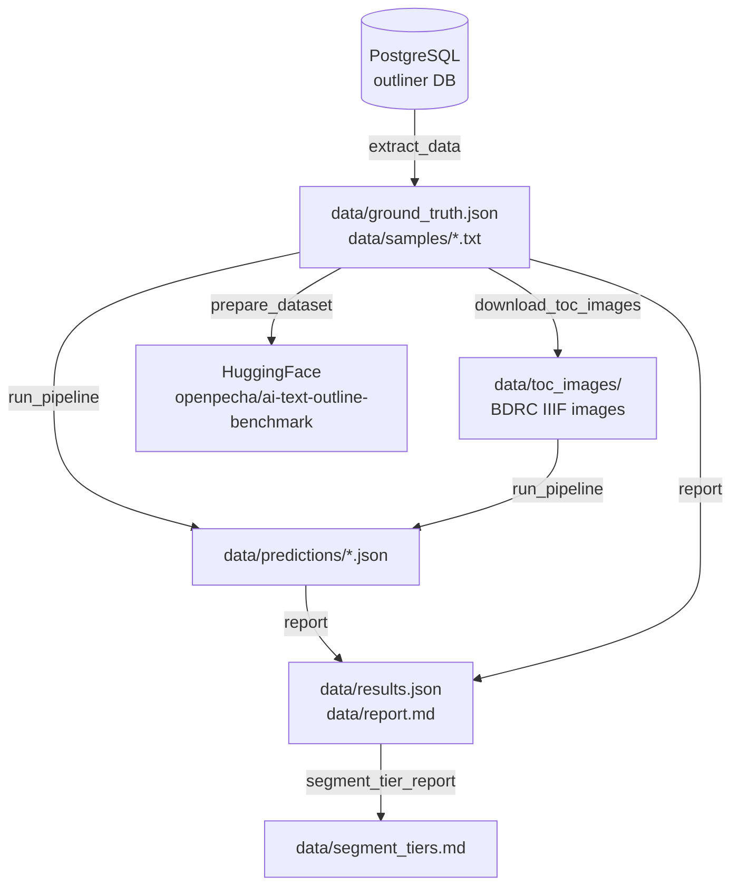

# Pipeline Architecture

End-to-end flow for the benchmark evaluation.

## Modules

| Module | Responsibility |
|---|---|
| `benchmark.extract_data` | Pull annotated text + breakpoints from the PostgreSQL outliner DB into `data/` |
| `benchmark.download_toc_images` | Fetch BDRC IIIF page images for the ToC window of each document |
| `benchmark.prepare_dataset` | Build and push a HuggingFace dataset from `data/samples/` + `ground_truth.json` |
| `benchmark.run_pipeline` | Call `ai_text_outline.extract_toc_indices` on each sample; write `predictions/` and `results.json` |
| `benchmark.report` | Aggregate per-document metrics into a human-readable `report.md` |
| `benchmark.segment_tier_report` | Classify documents by segment-count accuracy tier |
| `benchmark.review_samples` | Quality-review report for curating the sample set |
| `benchmark.metrics` | Shared F1@N, Pk, WindowDiff, title-F1 implementations |
| `benchmark.config` | Centralised path and constant definitions |
| `benchmark.run_all` | Orchestrator: runs all steps in order with `--skip-*` flags |

## Data flow details

### Extraction (`extract_data`)

Connects to the PostgreSQL database that stores human-annotated outlines from the
OpenPecha outliner tool. Pulls documents with at least one confirmed breakpoint.
Writes each document as `data/samples/{uuid}.txt` and accumulates metadata into
`data/ground_truth.json`.

### Image download (`download_toc_images`)

For each document in `ground_truth.json`, calls the BDRC backend API to resolve
the volume's page list, then fetches JPEG images for the ToC window (first
pages up to the image-bounded ToC end) from the BDRC IIIF endpoint. Images are
stored in `data/toc_images/{doc_id}_{volume_id}/` and gitignored.

### Pipeline run (`run_pipeline`)

Calls `ai_text_outline.extract_toc_indices` for each sample. Accepts optional
paths to override the default `data/` locations. Writes a JSON prediction file
per document and a combined `results.json` with per-document metrics.

### Metrics

Computed in `benchmark.metrics`:
- **Breakpoint F1@N** at tolerances 50, 100, 200, 500 characters
- **Segment count** error (absolute and relative)
- **Title F1** with fuzzy token matching
- **Pk** and **WindowDiff** segmentation penalties
